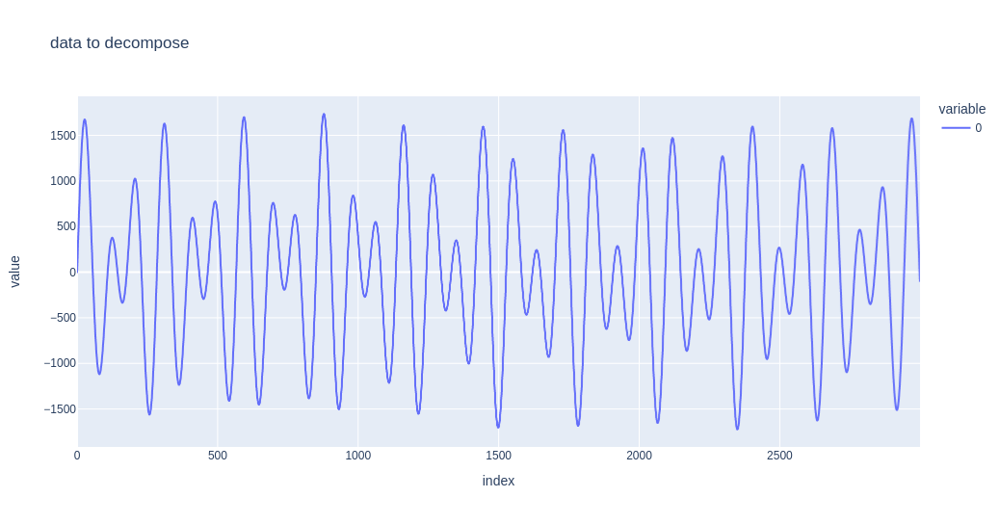
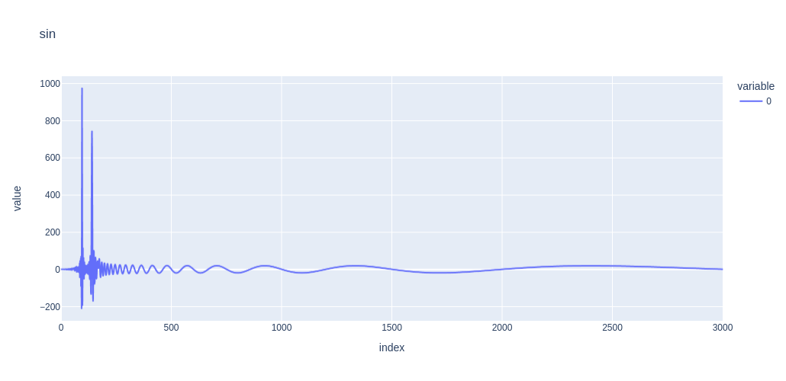

# Fourier Analysis

This words nicely for sine waves. You might need to adjust it for cos.

Input series composed of three sine waves:

frequency 95 amplitude 967
frequency 140 amplitude 731
frequency 170 amplitude 53

Notice that the amplitude of the first two waves listed, 967 and 731, respectively reflect the frequency of 95 an 140. Unfortunately, for this example, the amplitude of 53 is too small to detect visually from this graph at the 170 frequency.